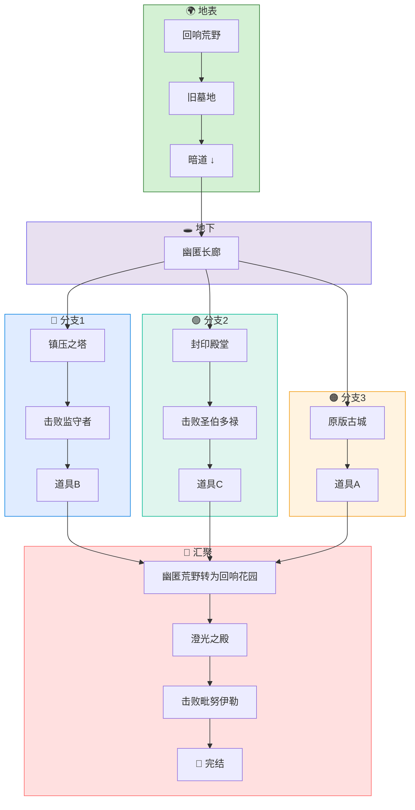

```table-of-contents
title: ## 目录
style：inlineFirstLevel
includeLinks: false
```
## 总路线



## 核心概念·回响

在游戏中的体现：通过吸取一定范围内的生物血量，造成一定比例的额外伤害的行为。（对于幽匿力量而言，这也会吸取自身的血量）

回响与幽匿的关系：回响是毗努伊勒从层沙之力中提纯出的纯净力量，而幽匿是在主世纪时受到月蚀力量影响形成的污秽力量。

幽匿力量在主世纪初年（毗努伊勒窃光时）就已出现，但众祭司通过献祭自我的方式将其封印在了封印神殿中，直到月蚀纪后，封印松动，以幽匿荒野的形式展露在世界上。

## 模拟效果
### 「失魂」 （Disoriented）
- 最大等级为III 
- 效果：
	- 向实体添加强度为(0.10×等级 + 0.10)的坐标视野摇晃 
	- 向实体添加(等级+2)的虚弱 
	- 向实体添加(等级+1)的缓慢 

### 「侵蚀」 （Erosion）
- 最⼤等级为III 
- 效果：
	- 向实体添加强度为(0.20×等级 + 0.20)的坐标视野摇晃 
	- 每1s向实体造成(2 + 等级×2)点魔法伤害
	- 向实体添加(等级+3)的虚弱 
	- 向实体添加(等级+2)的缓慢 

## 群系

### 幽匿原野

- 种类：平原
- 温度：0.8
- 降水：0.4
- 地物：幽匿嫩芽（可用于酿造黑暗药水）

荒芜的原野，经幽匿侵蚀后变得死气沉沉。

### 回响花园

- 种类：平原
- 温度：0.8
- 降水：0.4
- 地物：回响蕨、回响玫瑰、回响小灯草

经过封印后的幽匿原野，开满了幽蓝的鲜花。

其实这并不是严格意义上的生物群系，只是幽匿嫩芽转换为了回响蕨、回响玫瑰、回响小灯草的幽匿原野。

## 结构

### 旧墓地

自然生成于幽匿原野，为西式公墓类型建筑。

中心区域有通往幽匿长廊的竖井。

- 阅读物：阅读物A

### 地表隘口

自然生成于主世界各个群系，生成概率较小。与战斗高塔相似，但是最底层为幽匿方块和包含幽匿生物的刷怪笼。

- 阅读物：阅读物B

### 幽匿地牢

自然生成于主世界地下，与普通地牢类似，但会被替换为各种幽匿方块。

### 幽匿长廊

地下长廊式建筑，与旧墓地的竖井直接相连（技术上属于同一拼图结构），直廊的尽头是三岔路，一头通向封印殿堂，一头通向镇压之塔（地下部分）。

直长廊处有四幅壁画。

- 阅读物：阅读物C系列、阅读物D

### 封印殿堂

BOSS 战场所，封印着圣伯多禄。

- 阅读物：阅读物 E

### 镇压之塔

理论上属于地表隘口的下半部分，但实际上并不相连。封印着监守者。

- 阅读物：阅读物 F


### 澄光之殿

决战场所，封印着毗努伊勒。

- 阅读物：阅读物 G

## 实体
### 非生物实体

#### 幽匿飞弹

对玩家造成 5~8 的弹射物伤害，同时为玩家添加失魂 II 25 秒的负面效果。

### 敌对生物（幽匿）

#### 幽匿众徒

- 血量：40
- 攻击：5
- 额外近战攻击：`周遭 5 格内普通生物数量*0.3`
- 幽匿蚕食伤害：5
- 强度：弱

被幽匿所腐蚀的敌对生物，近战攻击会为玩家添加失魂 I 20 秒的负面效果。

当生命值降低为 10 时，立刻对周遭 5 格内所有生物添加侵蚀 I 10 秒，并造成 3 点伤害。

其包含下面变种：

- 人形；
- 骷髅（远程攻击）；
- 村民

会在侵蚀地牢、地表隘口、幽匿长廊中伴随刷怪笼生成。

#### 幽匿残魂

- 血量：35
- 近战攻击：6
- 额外近战攻击：`周遭 5 格内普通生物数量*0.5 + 周遭 5 格内幽匿众徒生物数量* 1.2`
- 幽匿蚕食伤害：3（普通生物）/1（幽匿生物）
- 强度：中

类似于幽灵的生物，漂浮在空中，会发射幽匿飞弹。

死亡时，会发生不摧毁方块的爆炸，并且给予周遭 5 格内所有生物侵蚀 I 10 秒与黑暗 I 15 秒。

会在地表隘口、幽匿长廊中伴随刷怪笼生成。

#### 幽匿蛭虫

- 血量：20
- 攻击：5~8
- 额外近战攻击：`周遭 5 格内普通生物数量*1.2`
- 幽匿蚕食伤害：2
- 强度：中

会撕咬玩家，并为玩家添加失魂 I 10 秒的负面效果。

击败的幽匿、回响怪物后有 22~25% 概率生成。

#### 幽匿祭司·现世

- 血量：60
- 近战攻击：5
- 额外近战或药水攻击：`周遭 5 格内普通生物数量*0.8+周遭 5 格内幽匿生物数量 * 1.5`
- 幽匿蚕食伤害：2（普通）/1（幽匿）
- 可以投掷药水攻击
- 强度：高

月蚀纪时因幽匿力量泄露而被污染的第三王国祭司，近战攻击会为玩家添加失魂 III 10 秒的负面效果。

血量降低至 15 时，会将周遭 5 格内可用的游戏元素转为幽匿蛭虫为己用：

- 幽匿众徒
- 幽匿蛭虫
- 幽匿植物

被其击败的生物，死后有 80% 概率在原地生成一只幽匿残魂。

会在幽匿长廊中生成。


### 敌对生物（回响）

#### 回响术士

- 血量：60
- 可以投掷药水攻击
- 强度：中

精英怪物，会投掷带有侵蚀 I 20秒效果的药水瓶，也会进行削弱过的声波攻击。

每次攻击，有 75% 概率将敌人的正面效果转换为对应的负面效果。

死亡时，会发生不摧毁方块的爆炸，并且给予周遭 5 格内所有生物侵蚀 II 15 秒与黑暗 I 15 秒。

会在澄光之殿、封印殿堂中生成。

#### 回响战兽

- 血量：85
- 冲撞攻击伤害：12
- 强度：高

类似于劫掠兽的怪物，会对玩家冲撞造成伤害，也会进行削弱过的声波攻击，并给予玩家侵蚀 I 25秒.

会在封印殿堂、澄光之殿中生成。

#### 回响殿卫

- 血量：80
- 远程攻击伤害：5

由生命值降到 10 以下时，转为隐身（带有粒子效果）

会用弓箭攻击玩家，并给予玩家侵蚀 II 10 秒。

会被 BOSS 召唤生成。

### 敌对生物（？？？）

#### 原初的射影

- 血量：50
- 近战伤害：5

会被毗努伊勒召唤，且受到的伤害会以 1:3 的比例同步给毗努伊勒，对敌人造成的伤害会以 2:1 的比例给毗努伊勒回复生命值。

## BOSS
### 最初的祭礼官，圣托马士

- 血量：800
- 近战攻击：8
- 音波伤害：12

与原版监守者机制类似，但是削减了攻击伤害防止玩家被秒杀。

召唤方式：不用召唤

掉落物：

- 道具 B

### 天钥的司掌人，圣伯多禄

- 血量：1500
- 近战攻击：10
- 音波伤害：12

召唤方式：点燃倒置十字架中心的特殊石砖

【普通攻击】司掌人用手中权杖进行挥舞，对敌人造成 10 点伤害的同时，给予其失魂 I 15 秒。

**【污秽的暗影】**

当司掌人半径 25 格范围内有幽匿生物死亡时，直接对使者造成 20 点伤害

**【永生神之子】** CD 40 秒

在自身周边召唤残血幽匿祭司与幽匿残魂各两只。

*「彼埃尔，我要把我的教会建造在这磐石上，阴间的权柄不能胜过他！」神曾如此昭告我*

**【天钥的权柄】** CD 60 秒

血量降低至 15 时，会将周遭 5 格内可用的游戏元素转为幽匿残魂为己用：

- 幽匿众徒
- 幽匿蛭虫
- 幽匿植物

如果没有可用游戏元素，则会直接召唤 4 只幽匿蛭虫。

*「我要把天国的钥匙给你，凡你在地上所捆绑的，在天上也要捆绑；凡你在地上所释放的，在天上也要释放。」神曾如此昭告我*

**【倒置的殉道者】** 血量低于 50 时自动触发

使者杀死自身周围 12 格除了非生物实体和玩家的所有实体，并将该范围内所有玩家造成大范围伤害。

该技能对幽匿生物也有效，但不会触发 **【污秽的暗影】** 技能。

- 玩家伤害计算公式：`20 + ENTITY_NUM * 2.5`
- 带有饰品·染血锁链可以减免 60% 伤害

*「因为凡要救自己灵魂的，必丧掉灵魂；凡为神丧掉灵魂的，必得着灵魂。」*

### 窃光的使者，毗努伊勒

- 血量：3000

召唤方式：不用召唤，在澄光之境中自然生成

**【虚妄的幻影】** 被动技能

使者本身不受伤害，需要击败使者的召唤物、幽匿或者回响生物进行伤害。

当使者半径 25 格范围内：

- 有幽匿生物死亡时，直接对使者造成 8~15 点真实伤害
- 有回响仆从死亡时，直接对使者造成 30~45 点真实伤害
- 有原初造物死亡时，直接对使者造成 70~85 点真实伤害


**【回声响荡】** 开局一次，之后间隔为 60 秒

在使者前、后召唤回响仆从，左、右召唤原初造物。

**【面神的禁锢】** 冷却 35 秒

给予半径 30 格内所有玩家 15 秒失魂III。


**【末劫之火】** 冷却 85 秒

将半径 15 格内玩家脚下方块替换为岩浆，并立即使玩家着火。


**【响彻长空的回响】** 冷却 300 秒，且血量低于 150 时自动触发

在半径 15 格，在玩家头顶召唤闪电，杀死半径 30 格内所有除玩家和自身外的实体，并将对玩家施加伤害。

第一次使用此技能时，还会基于杀死实体的数量与周遭幽匿回响植物的数目，回复自身生命值。

- 玩家伤害计算公式：`40 + ENTITY_NUM * 2.5`
- 回复血量计算公式：`50 + ENTITY_NUM * 1.5 + PLANT_NUM * 1.2
- 带有饰品：回响残杖可以减免 60% 伤害

掉落物：

- 巴别塔碎片·回响

## 道具
### 普通道具

#### 回响烬末

熔炼回响碎片获得，同时幽匿众徒、幽匿蛭虫、幽匿残魂也会掉落。

可以食用，回复 2 点饥饿值，食用后给予玩家力量I 15 秒，并将玩家的失魂效果降低一级。

#### 回响药水

在炼药台上通过回响烬末获得。

饮用后消除自身的侵蚀或失魂效果，同时给予自身夜视 I 30 秒，力量 II 30 秒。

#### 祭礼残杖

在旧墓地、地表隘口、幽匿地牢、幽匿长廊战利品箱中获得。

可佩戴在饰品槽的「符文」槽位，佩戴后对幽匿生物造成的伤害获得 20% 的伤害减免，同时大幅减轻失魂造成的负面效果，减轻侵蚀造成的负面效果。

#### 染血锁链

在地表隘口、幽匿地牢、幽匿长廊战利品箱中获得。

击败幽匿祭司·现世必定掉落。

可佩戴在饰品槽的「符文」槽位，佩戴后对幽匿生物造成的伤害获得 20% 的伤害减免，对回响生物造成的伤害获得 10% 的伤害减免，同时大幅减轻失魂造成的负面效果，减轻侵蚀造成的负面效果。

佩戴后获得缓慢 II 效果，并获得力量 III。

#### 原初水壶

击败幽匿祭司·现世获得。

消耗品，对幽匿众徒、幽匿蛭虫、幽匿残魂使用后有 50% 概率将其身上的幽匿力量净化，为玩家所用（也就是被驯服了）。

#### 回响残杖
    
由幽匿残杖与原初水壶合成而来，也可以由击败回响术士、回响殿卫获得。

可佩戴在饰品槽的「符文」槽位，佩戴后对幽匿生物造成的伤害获得 40% 的伤害减免，对回响生物造成的伤害获得 20% 的伤害减免，同时免疫失魂造成的负面效果，大幅减轻侵蚀造成的负面效果。


#### 祭司执剑

- 耐久：1200
- 伤害：8
- 额外伤害（幽匿）：15
- 额外伤害（回响）：10

通过回响残杖（模板）、回响烬末（材料）和钻石剑在锻造台上锻造获得。

可以被回响烬末修复。

### BOSS 战利品

#### BOSS 人偶

有三种变种。

#### 道具 A·祀城旧瓦

在古城战利品箱中随机获得。

#### 道具 B·祭礼残魂

击败「最初的祭礼官，？？？」获得。

#### 道具 C·血染之钥

击败「天钥的司掌人，圣伯多禄」

#### 道具 D·通往何处之钥

由祀城旧瓦、祭礼残魂、血染之钥合成，使用后可以进入澄光之境。

#### 窃光之目

由「窃光之使者，毗努伊勒」掉落。

可佩戴在饰品槽的「头饰」槽位。

佩戴后对幽匿生物造成的伤害获得 80% 的伤害减免，对回响生物造成 60% 的伤害减免。同时对幽匿、回响生物造成荆棘伤害。

佩戴后玩家完全免疫失魂、侵蚀效果。

荆棘伤害计算方法：

- 幽匿：`15 + DMG * 1.2`
- 回响：`10 + DMG * 0.8`

#### 轮回的铸剑  

- 近战攻击：8
- 耐久：1500
- 通过回响碎片修复

击败「最初的祭礼官，？？？」获得。

普通攻击有 60% 概率进行「地上的轮回」，并消耗玩家 10 经验。

##### 「地上的轮回」

对半径 10 格内普通怪物造成 8 点伤害，对半径 10 格内回响怪物造成 15 点伤害
   
此后，直接击杀半径10格内某一幸存怪物。


#### 殉道的权杖

- 近战攻击：12
- 耐久：1500
- 冷却：10 秒
- 弹药：锁链飞弹（无需装填）
- 通过金锭修复

击败「天钥的司掌人，圣伯多禄」获得。

##### 锁链飞弹

- 基础伤害：8

命中后：
-  将其束缚在当前位置无法移动，持续 5 秒
- 束缚期间，目标每秒受到 2 点魔法伤害   
- 为发射者自身回复`TARGET_MAX_HEALTH * 0.1` 或 10 点（敌人生命值大于 100）生命值
- 对BOSS的束缚时间减半（3秒），且不造成额外魔法伤害，回复生命值固定为 5

## 任务

### 第四章·第一幕 九重地之下

这一章引导玩家熟悉幽匿回响相关机制

#### 回响之碎片

高高搭起的祭台与金杯中的血水旁，大主教波提非拉正尝试用秘法驱散亡魂。

幽蓝色的烟雾弥漫着——他成功了。

- 要求：获得回响碎片
- 奖励：回响硬币×5

### 第四章·第二幕 魂灵的监守「人」

> 我虽然行过死荫的幽谷，也不怕遭害。因为你与我同在。你的杖，你的竿，都安慰我。


这一章主要引导玩家击败「天钥的司掌人，圣伯多禄」和「最初的祭礼官，？？？」


### 第四章·第三幕 澄澈光幕中

这一章主要引导玩家击败「窃光的使者，毗努伊勒」

## 维度
### 澄光之境

澄光之殿所在的维度。

由于接口限制，暂定玩家只能在其中的澄光之殿中活动，若意外掉出澄光之殿则收到虚空伤害。

若后续添加了自定义维度的地形生成接口，则通过第四章后日谈的形式开放澄光之殿外的区域。

## 阅读物

### 阅读物 A·致「扫墓者」

（自然生成于旧墓地战利品箱中）

致来者：

我不知道你是谁，但你既然已经行至此处，那我便不再隐瞒。

为渡那场大战中的逝者，我们的大祭司，面神的毗努伊勒曾为主献上了原始的力量，她称之为「回响」。

窃光的年华，幽蓝从地下蔓延生长，幽匿的恐惧席卷王国，不久危机解决，但穆鲁斯亚的君王和祭司们永远凋零在了地下，这里即是他们灵魂的栖息地。

来者，请不要再前进，如果你听到地底传来低语，如果你听到竖井传来哽咽：

那不是风声，而是长天在回响。

### 阅读物 B·逃难者的遗书

（自然生成于地表隘口、幽匿地牢、幽匿长廊战利品箱中）

主世纪的第一百零七年，我要在这里写下遗言。

子夜时分，大地震动，我们本以为是一次地震，但向外望去：大地被活生生撕开了一道隘口，蓝黑色的物质从其中涌出，伴随着持续、尖锐的轰鸣，像是地底的乐队为世界的毁灭作一首安魂曲。

它们爬出来了。黑色的、蓝色的、没有脸的东西，像是一个个团块，长着十条腿，还像是长着十七条腿。我感受到它们正把我的村庄变成另一种东西。我不敢直视它们，只有躲避。

我逃出来了。我躲在隘口上方的石缝里。

三天了，我已经三天没有感受到阳光了。隘口还在往外涌——今天涌出来的东西比昨天更高、更暗。

我看到了……妈妈……爸爸……你们来救我了……对吧……

*（笔记的下方被大片幽蓝色掩盖，再也无法看清）*

### 阅读物 C 系列·窃光的年华


*（第一幅）*

>神的灵运行在水面上。
>神说，要有光、就有了光。
>大祭司以指划天，以足分地，与神倾谈。
>于是我们传唱：
>**【毗努伊勒面对面见了神，毗努伊勒的性命仍得保全。】**

*（第二幅）*

> 天地崩颓，幽冥的大门打开。
> 地下的使者降给我们灾祸。
> 将死的人复生，存活的生灵将死。

*（第三幅）*

> 饮下鲜红的美酒，祭司向彼岸走去。
> 第一位走下去，没有回来。
> 第二位、第三位走下去，也没有回来。
> 第十二位，大门关上。

*（第四幅）*
> ……？？？终将归来……


### 阅读物 D·祭司手记

（自然生成于幽匿长廊战利品箱中）

第一百三十天，通向幽冥的大门……彻底关上了。

在战争结束之初，主世界中还游荡着两族的亡魂，我们的大祭司毗努伊勒率人建起了地下的城市，供亡魂栖息。

那东西是从哪冒出来的，谁也不知道——起初只是覆盖了几个方块，每死一人，它就扩大几格，直到成了现在这个鬼样子。

灾害爆发的那晚，我们祭司虽然免于已死，却被圣伯多禄，我们的王囚禁，他用锁链锁住了我们。

「我不信这灾害只能如此解决」我听到祭司长托马士这么说。
「如果非要如此，
「请先让死亡在我身上留下钉痕，让腐灼先吞噬我的肋下
「我不愿看到那些孩子们如此死去」

就回忆到这里吧，我感到背上有东西在啃咬，说话的声音也多了一层回声，身后似乎有人追了上来，我已经忘掉了阳光的颜色，她好像……是温暖的。

这是幽匿在侵蚀我们吗？我不知道，是的话也无所谓。虽然地上的百姓迟早会将我们忘掉……但

长天会记住我们。

### 阅读物 E·穆鲁斯亚的再建

（击败「天钥的司掌人，圣伯多禄」获得）

太古的战争结束后，主令我，彼埃尔登上圣座，统领人类。

人们都尊称我为磐石的王，或者是圣伯多禄。

「主世沙海中的旧文明已被我诛灭」
「你不能朽坏、不能玷污、不能衰残，
「这样方可以得着旧文明的财宝与力量」主对我说。

于是我率幸存的人类迁向主世，再建名为穆鲁斯亚的乐园（穆鲁斯亚就是高墙的意思），挡住世界外的一切苦痛与战乱。

但此时无数死去的亡魂从在世间游荡，残害众生。

波提非拉，我的副祭，得知了帝王谷发现了法老残骸，便赶向那里。他效仿珂西斯洛，也就是第一个穆鲁斯亚王国的第一位王，拿各类洁净的牲畜、飞鸟献在坛上燔祭，可不奏效。

一日，奥西里斯的亡魂在梦中昭示波提非拉，若想驾驭这秘法，必先付出最高的代价——随着
数十名无名矿工的失踪，人们最终看见了使用秘法驱散亡魂的大主教波提非拉。

后来，面神的毗努伊勒帮助我，也帮助主封印了这些亡魂到祀城中去。

直到如今……灾难再次爆发，我囚禁了祭司，告诉他们：要么看着穆鲁斯亚再一次覆灭，要么用自己的生命为主世界换来永久的安宁。

他们只是以为我要铲除异己，直到托马士第一个走了进去。

第二个、第三个，到了第十二个，已经没有祭司可以走进去了，…………………………。

大门终于合上了，但封印不会永远持续下去。
### 阅读物 F·托马士福音

（自然生成于幽匿长廊战利品箱中）

托马士第一个走了进去，
人们没有听到他的惨叫嘶吼，但见幽匿的大门黯淡下去。

接着是第二个、第三个……一直到第十二个，大门只微微开着一条缝。
十二位祭司被幽匿杀死……或者说重塑了。
人们的眼前浮现起他们的模样，一点点被侵蚀：
骨色灰白，血肉成岩。

但灾祸还在继续，这景象分明是幽匿在渴求主人。
「我们的王……所有幸存的祭司……都以投入此门」
王不作声，任凭长空回响。
他终于站起身，走了进去。

他们失去了知觉，失去了理性。
他们只记着守护，
在漫长的岁月中监守，用嘶吼击退所有来者。
说他们是英雄也好，魔物也罢。
这就是我们传颂的故事，将要留给后代的。
圣徒比埃尔和托马士的十三祭司故事。

### 阅读物 G·窃光的使者

（击败「窃光的使者，毗努伊勒」获得）

太古的鏖战后，大地一片荒芜。
极北的荒漠，生死交汇之地，少女矗立在这里，提剑手指神明。

「三重灾厄的主人，我质问你，若你为『人』带来自由，又何将无知的大众葬下九重地之下？」
「三重灾厄的主人，我质问你，我自你所造的墓穴归来，自由岂是在赤焰中灼烧信徒与异端？」
「三重灾厄的主人，我违抗你，我所爱者倒在无尽青春，你会为他付出血的代价。」

阖上眼睛再张开，如此循环了百转，神在决斗中给予了她最大的惩罚。
她只看到，一条血红的丝带飘进脑中，而后便领悟到了什么。

黎明撕裂黑暗，她瘸腿而立，向南走去，输下了决斗，却得着了新讳——「毗努伊勒」，面神之人。

她走入村落，人们因她幽蓝的双眼而恐惧奔走，甚至向她投掷石子。
她行过田野，小麦因她的行迹而不再生长，枯萎在土地之上。
她途径墓园，听到人们哀伤连绵的话语，看到与她眼眸一样颜色的魂灵。

她最终来到王城，自称能够重塑光的秘法。
于是，沙加缅度的古老力量最终转为了可以隔离生死、实现轮回的回响之力……
第二任大祭司毗努伊勒，带领奴仆在地下建立了规模宏大的「祀城」。

阴暗、逼仄、曲折而且诡异，如同大战前的地穴一样，就是世界上最明亮的灯也照不亮那些仿佛有生命的、跳着蓝绿色光点的漆黑材料。

在那里，少女度过了孤独的一生——尽管在沉眠前，她的生活并非如此。

「我相信，我们终会在大地之上重逢」她最后一次阖上眼睛，缓缓说到。

言毕，她就来到了一个澄澈空阔的世界。
「这就是你最后的惩罚吗，克洛尼斯·庞提乌斯·彼拉多 *(Chronis Pontius Pilatus)* ？ 」

### 炼狱日记

## NPC 对话
