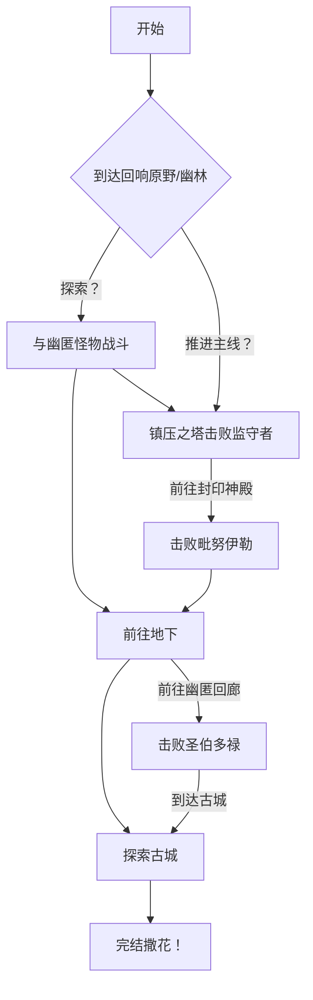

## 核心概念·回响

在游戏中的体现：通过吸取一定范围内的生物血量，造成一定比例的额外伤害的行为

回响与幽匿的关系：回响是毗努伊勒从层沙之力中提纯出的纯净力量，而幽匿是在月蚀纪时受到月蚀力量影响形成的污秽力量。

幽匿力量在主世纪末就已出现，但众祭司通过献祭自我的方式将其封印在了封印神殿中。

## 模拟效果
### 「失魂」 
- 最大等级为III 
- 效果：
	- 向实体添加强度为(0.10×等级)的⻆度视野摇晃 
	- 向实体添加(等级×2)的虚弱 
	- 向实体添加(等级×1)的缓慢 

### 「侵蚀」 
- 最⼤等级为III 
- 效果：
	- 向实体添加强度为(0.20×等级)的⻆度视野摇晃 
	- 每1s向实体造成(等级×2)点魔法伤害
	- 向实体添加(等级×2)的虚弱 
	- 向实体添加(等级×1)的缓慢 

## 生物群系

### 幽匿原野

- 种类：平原
- 温度：0.8
- 降水：0.4
- 地物：幽匿嫩芽（可用于酿造黑暗药水）

荒芜的原野，经幽匿侵蚀后变得死气沉沉。

### 回响花园

- 种类：平原
- 温度：0.8
- 降水：0.4
- 地物：幽匿嫩芽、回响蕨、回响玫瑰、回响小灯草（可以与金锭合成回响烬末）

经过封印后的幽匿原野，开满了幽蓝的鲜花。

## 结构
    
### 侵蚀地牢
有幽匿蜘蛛、幽匿骷髅、幽匿僵尸三种类型，自然在 Y＜0 的地下生成。

### 园丁小屋

在回响花园中自然生成，内含一个回响园丁。

### 往界之墓

在回响花园或幽匿原野生成，公墓类型的建筑，会生成幽匿残魂。
### 地表隘口

在主世界随机自然生成

### 镇压之塔

在回响原野、回响幽林自然生成。

三层石塔，含有战利品箱与受蚀者刷怪笼，最高层有幽匿尖啸体。

### 封印神殿

在回响原野、回响幽林自然生成。

BOSS 战结构，其中含有失目坟冢。

### 幽匿长廊

## 生物

### 友好生物

#### 回响园丁
- 血量：25

在封印幽匿力量后幸存的祭司后代，永远地在回响花园中游荡……

可以使用回响硬币与其交易。
### 非生物实体

#### 幽匿蚀牙

由回响术士召唤，会对站在蚀牙上的生物造成 8 伤害。

#### 幽匿飞弹

对玩家造成 5~8 的弹射物伤害。

### 敌对生物

**下面怪物属于幽匿怪物**
#### 幽匿众徒

- 血量：40
- 攻击：5

被幽匿所腐蚀的敌对生物，近战攻击会为玩家添加失魂 I 20 秒的负面效果。

其包含下面变种：

- 人形；
- 骷髅（远程攻击）；
- 村民

会在侵蚀地牢、地表隘口中伴随刷怪笼生成。

#### 幽匿残魂

- 血量：45
- 近战攻击：8

类似于幽灵的生物，漂浮在空中，距离玩家比较远时会发射幽匿飞弹。

会在回响原野、回响幽林亮度＜7时自然生成。

#### 幽匿蛭虫

- 血量：30
- 攻击：5~8

会撕咬玩家，击败除自身外的幽匿、回响怪物后有 12% 概率生成。

同时，会在封印神殿中自然生成。

**下面怪物属于回响怪物**
#### 受蚀者

- 血量：50

外形类似于人类体格大小的监守者，可以进行收到削弱的声波攻击。

掉落献祭之壶。

#### 回响术士

- 血量：60

精英怪物，会投掷带有侵蚀效果的药水瓶，也会进行削弱过的声波攻击。
#### 回响殿卫

- 血量：80

## BOSS

#### 受侵蚀之兽，监守者

#### 窃光之使者，毗努伊勒

- 血量1800
- 近战攻击8
- 召唤方式：在封印神殿中

##### 虚妄的幻影

使者本身不受伤害，需要击败使者的召唤物/幽匿生物进行伤害

当使者半径25格范围内有回响仆从死亡时，召唤新的回响仆从。

当使者半径25格范围内有幽匿生物死亡时，直接对使者造成15点伤害。

当使者半径25格范围内有回响仆从死亡时，直接对使者造成35点伤害。

##### 回声响荡之徒
在使者前、后、左、右召唤回响仆从

仅使者被召唤时进行一次

技能文案：

##### 摩诃钵特摩之锢
给予半径30格玩家15秒失魂III
冷却35秒
技能文案：
##### 檀林末劫之火
冷却100秒
半径15格
将玩家脚下方块替换为岩浆块，并立即使玩家着火
##### 终结技·响彻长空的回响
冷却150秒
 半径15格

在玩家头顶召唤闪电

#### 天钥之司掌，圣伯多禄

血量2000，近战攻击10
##### 污秽的暗影
使者现在受到伤害，但本体移速与攻击力得到加强

当使者半径25格范围内有幽匿生物死亡时，直接对使者造成20点伤害

##### 没想好名字

使者杀死自身周围 12 格除了非生物实体和玩家的所有实体，并将该范围内所有玩家造成大范围伤害。

伤害值=所有被击杀生物最大血量×80%
持有破碎的古图腾可以减免 60% 的伤害
## 道具

### 回响烬末

熔炼回响碎片获得。

可以食用，回复2点饥饿值，食用后给予玩家力量I 15s，并将玩家的失魂效果降低一级。

### 摄魂之心

通过摄魂之杖击败敌人获得。

本质是一个类似于刷怪蛋的道具，当摄魂之杖击败敌人时，在敌人死亡处会生成一个对应种类的摄魂之心，使用后即可召唤对应的生物。

### 献祭之壶

用于驯服幽匿怪物，使其为玩家所用。

可以合成献祭之杖，用于大范围驯服幽匿怪物。

### 回响药水
炼药台上水瓶+回响的烬末炼制获得
    
可以饮用，给予玩家力量II 15s，同时去除玩家的失魂效果

### 回响苹果

可以食用，回复 5 点饥饿值。

### 幽匿灵符
    
探索侵蚀地牢获得，加快半径 6 格内回响、幽匿生物移速，给予自身「侵蚀」III 15s

### 回响灵符
    
由幽匿灵符与献祭之壶合成而来，也可以由击败回响术士、回响殿卫获得。

使用后，半径 10 格内的回响、幽匿生物移速被大幅减缓，而一般生物（除玩家）直接无法移动。

### 古图腾
    
由回响碎片与已然破碎的古图腾合成而来
    
类似于眼镜蛇的图腾，手持/副手持有时会免去玩家因获得侵蚀或失魂效果带来的伤害。

### 献祭之杖

- 耐久：64
- 修复：献祭之壶
- 法杖基础攻击：3
- 搜索半径：5

由献祭之壶与木棍合成而来。

使用时，会将搜索半径内所有幽匿怪物驯服为玩家所用。

## BOSS 掉落物
### 已然破碎的古图腾

由「受侵蚀之兽，监守者」掉落。

### 窃光之目

由「受侵蚀之兽，监守者」掉落。

可用于召唤「窃光之使者，毗努伊勒」

### 轮回的铸剑  
攻击 8，耐久 800，通过回响碎片修复
    
普通攻击有 45% 概率进行「地上的轮回」，并消耗玩家10经验
    
#### 「地上的轮回」
对半径 10 格内普通怪物造成 8 点伤害，对半径 10 格内回响怪物造成 15 点伤害
        
此后，直接击杀半径10格内某一幸存怪物。

### 摄魂之杖

当摄魂之杖击败敌人时，在敌人死亡处会生成一个对应种类的摄魂之心，使用后即可召唤对应的生物。

此效果对 BOSS、非生物实体无效。

### 巴别塔碎片·回响

## 任务

### 第四章·第一幕 九重地之下

#### 回响之碎片

高高搭起的祭台与金杯中的血水旁，大主教波提非拉正尝试用秘法驱散亡魂。

幽蓝色的烟雾弥漫着——他成功了。

- 要求：获得回响碎片
- 奖励：回响硬币×5

#### 占位符·击败监守者

### 第四章·第二幕 魂灵的监守「人」

> 我虽然行过死荫的幽谷，也不怕遭害。因为你与我同在。你的杖，你的竿，都安慰我。

#### 占位符·击败毗努伊勒

### 第四章·第三幕 永恒的安眠

#### 占位符·击败圣伯多禄
